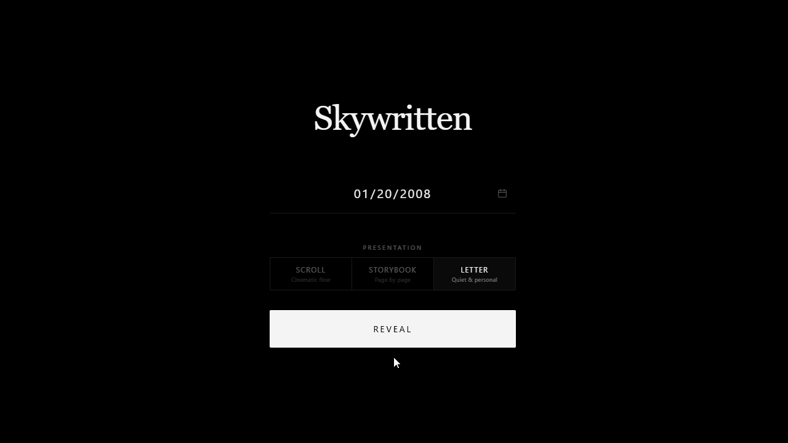

# Skywritten

A birthday gift generator that assembles an astronomical biography of any date from four NASA archives, then delivers it as a permanent link the recipient can keep.

[](https://skywritten.pages.dev)



## Quick Start

**[Open Skywritten here](https://skywritten.pages.dev)**

Enter a birth date, choose a presentation, and the biography assembles itself. Nothing to install, no account required.

## Features

- **Four-Archive Astronomical Assembly:** Drawing the Astronomy Picture of the Day, DSCOVR full-disk Earth imagery, solar flare records, and exoplanet discoveries for a single calendar date, then composing them into one continuous narrative.
- **Three Presentation Templates:** Rendering the same biography as a cinematic scroll, a page-turning storybook with a 3D leaf flip, or a wax-sealed letter the recipient cracks open by hand.
- **Voice-Matched Personal Message:** Rewriting the giver's own message through a language model that preserves their nicknames, rhythm, and phrasing rather than replacing it with generic sentiment.
- **Permanent Recipient Links:** Storing each finished gift in Cloudflare KV under an eight-character identifier, rendered server-side as a read-only page with its own link preview card.
- **Story Card Export:** Compositing the hero image, orbital statistics, and personal message into a 1080x1920 PNG sized for Instagram and WhatsApp stories.
- **Precise Archival Honesty:** Distinguishing an image captured on the exact birth date from one captured on the same calendar day in another year, and never claiming the former when the archive only holds the latter.

## Local Setup

Requires Node 18 or newer.

1. Clone the repository:

```
git clone https://github.com/saminsiddiqui08-beep/skywritten.git
cd skywritten
```

2. Supply a NASA API key. The key is used only by the build scripts and never reaches the browser:

```
$env:NASA_API_KEY="your-key-here"
```

On macOS or Linux, use `export NASA_API_KEY="your-key-here"` instead. A free key takes about a minute to obtain from [api.nasa.gov](https://api.nasa.gov).

3. Build the static archives. The EPIC indexer walks roughly 3,600 observation dates and takes 15 to 40 minutes, so it runs last:

```
npm run build:all
```

4. Serve the `public` directory with any static file server. The AI rewrite and link-sharing endpoints are Cloudflare Functions and require `wrangler pages dev` plus a Groq API key to exercise locally.

## Architecture

Skywritten makes no NASA API calls at runtime. Every archive is indexed at build time into static JSON, sharded one file per calendar day, so a birthday on January 20 fetches `01-20.json` from each source instead of the entire archive. The four monolithic indexes came to 3,210 KB per page load, and sharding brought the same query down to roughly 47 KB across the same four requests, which matters because that JSON blocks first paint on the mid-range Android hardware the app targets. The APOD index alone holds 10,931 verified images spanning 1995 to the present, filtered by both media type and file extension because NASA's own metadata occasionally labels an animation as an image.

Hero images route through a resizing proxy at three candidate widths, letting the browser request roughly the pixels it will actually paint rather than the print-resolution master, which for some archive entries exceeds 15 MB. Animated GIF entries bypass the proxy entirely so the animation survives, and their thumbnails request a mid-sequence frame because the first frame of a lunar cycle is an unlit new moon.

Gift links cost exactly one KV write. An earlier design spent three, one for the record and two more for an idempotency fingerprint and a rate-limit counter, which capped daily throughput at a third of the free tier's ceiling. Deduplication moved into the browser as a memoized request signature, and rate limiting moved to the Cloudflare Cache API, leaving the write quota entirely for gifts. The recipient view renders from a `mode` flag passed into the same template code the giver uses, emitting read-only markup directly rather than mounting the authoring interface and hiding its controls afterward.

The front end is vanilla HTML, CSS, and ES6 with no framework and no build step. The starfield is a seeded canvas render, so the same birth date always produces the same sky.

## Credits

- Astronomical data from [NASA APOD](https://apod.nasa.gov/apod/astropix.html), [DSCOVR EPIC](https://epic.gsfc.nasa.gov/), [DONKI](https://ccmc.gsfc.nasa.gov/tools/DONKI/), and the [NASA Exoplanet Archive](https://exoplanetarchive.ipac.caltech.edu/) at Caltech IPAC.
- Hosting and serverless functions on [Cloudflare Pages](https://pages.cloudflare.com/).
- Language model inference by [Groq](https://groq.com/).
- Image resizing by [wsrv.nl](https://wsrv.nl/).
- Built for the [Stardance Challenge](https://stardance.hackclub.com/), a Hack Club program in partnership with NASA, AMD, and GitHub Education.